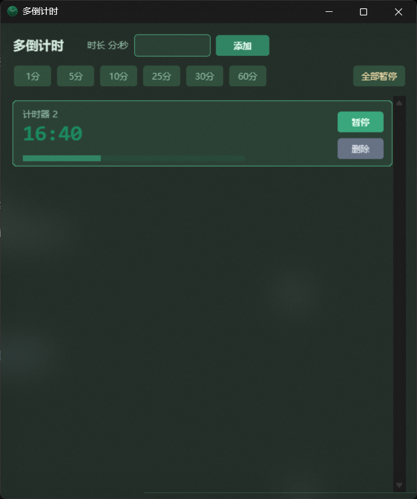
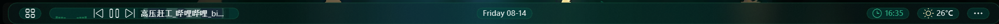

# MultiTimer

A Windows multi-countdown desktop app with a frosted-glass green theme. Run multiple countdown timers simultaneously, with system tray support, auto-start on boot, state persistence, native Toast notifications, and a local command-line API.

## Features

- **Multiple parallel timers** — run any number of countdowns at once, each with independent pause/resume/delete
- **Frosted glass UI** — Windows Acrylic blur + dark green theme with rounded cards
- **Custom names** — double-click a timer name to rename it (e.g. "Ramen", "Pomodoro")
- **Native notifications** — Windows Toast on completion (no sound)
- **State persistence** — timers (name/remaining/state) survive app restarts
- **System tray** — close minimizes to tray; optional auto-start on boot
- **Single instance** — launching again wakes the existing window
- **Local API** — control via `127.0.0.1` socket commands (status-bar tools friendly)
- **Quick presets** — one-click 1/5/10/25/30/60 minute timers

## Screenshots



*The main window — frosted glass dark green theme with rounded timer cards*



*Live countdowns shown in the YASB status bar via the Custom Widget integration*

## Quick Start

### Option A: Prebuilt binary (no Python needed)

Download `MultiTimer.exe` from [Releases](https://github.com/YOUR_REPO/releases) and run it.

### Option B: Run from source

Requires Python 3.10+:

```bash
pip install pystray pillow winotify
python main.py
```

## Command-line Control (API)

While running, the app listens on `127.0.0.1:8765`. Use `multi_timer_ctl.py`:

```bash
python multi_timer_ctl.py add 7:00             # add a running 7-minute timer
python multi_timer_ctl.py add 3:00 Ramen       # add with a name
python multi_timer_ctl.py list                 # list all timers (JSON)
python multi_timer_ctl.py toggle 1             # pause/resume timer #1
python multi_timer_ctl.py rename 1 Pomodoro    # rename timer #1
python multi_timer_ctl.py remove 1             # remove timer #1
python multi_timer_ctl.py pause                # pause all
```

### YASB Status Bar Integration

Use a [YASB](https://github.com/amnweb/yasb) Custom Widget to show live countdowns in your status bar:

```yaml
multi_timer:
  type: yasb.custom.CustomWidget
  options:
    label: "<span>\ue823</span> {data}"
    class_name: "multi-timer-widget"
    exec_options:
      run_cmd: "python D:/DevTools/MultiTimer/timer_status.py"
      run_interval: 1000
      return_format: "string"
      hide_empty: true
```

(`timer_status.py` / `timer_add.py` live in `extra/`)

## Project Structure

```
multi_timer/
├── main.py                    # entry point
├── multi_timer_ctl.py         # command-line control script
├── app/
│   └── window.py              # main window entry (single-instance check)
├── features/
│   └── timer_pack/
│       ├── config.py          # configuration (API/theme/presets)
│       ├── task.py            # core logic (TimerTask/TimerManager)
│       ├── cards.py           # rounded UI components
│       ├── api.py             # local socket API server
│       └── pack.py            # feature pack entry (window/tray/persistence)
├── extra/                     # YASB integration scripts
├── make_icon.py               # icon generation script
└── dist/                      # build output
```

## Build to EXE

```bash
pip install pyinstaller
pyinstaller --noconfirm --clean --onefile --windowed \
  --icon MultiTimer.ico \
  --add-data "MultiTimer.ico;." \
  --add-data "MultiTimer_256.png;." \
  --add-data "MultiTimer_128.png;." \
  --name MultiTimer main.py
```

## Technical Details

- UI: `tkinter` + Windows Acrylic API
- Notifications: `winotify` (native Windows Toast)
- Tray: `pystray`
- Icon: generated with `Pillow` (frosted-green clock, see `make_icon.py`)
- Single instance: Windows Mutex
- Persistence: JSON state file (`multi_timer_state.json` next to the exe)

## Author's note

This is just a very small project created by a middle school student, and I use AI to help me debug and mix, so it is not as great as many other projects which have the same functionality. If you have any problems when using this app, I'll try my best to fix it. And I may not have enough time to deal with your suggestions and the bug reports. (excuse me!!!)

## License

MIT License, see [LICENSE](LICENSE).
